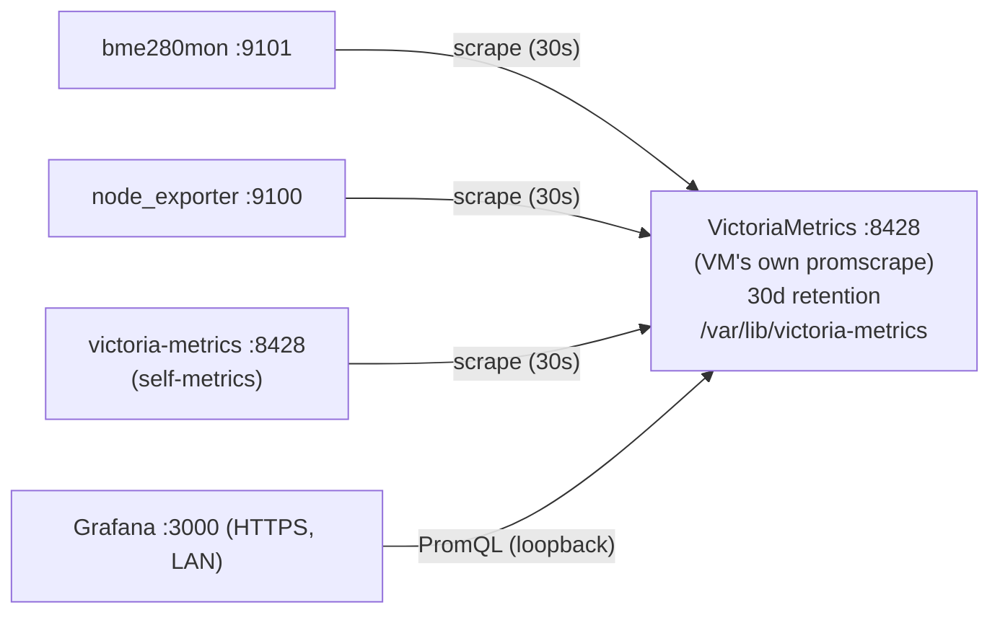

# bme280mon monitoring stack: VictoriaMetrics + Grafana on the Pi

**Date:** 2026-08-08
**Repo:** `github.com/e4jet/bme280mon` (`~/repos/bme280mon`)

## Purpose

`bme280mon` already exposes readings as Prometheus metrics but nothing stores or displays them. This design adds the downstream half the original project design deliberately deferred ("A UI/dashboard (Grafana lives downstream of the metrics endpoint)"): a time-series database that retains readings, and a dashboard for looking at them.

## Project guidelines (binding)

This project **MUST** follow `docs/project-guidelines.md`. The stack is shell, systemd, and config rather than Go, so the rules that bind hardest here are:

- **Security:** validate inputs, explicit I/O timeouts, prefer TLS (TLS 1.2 minimum with FIPS-approved cipher suites), never log secrets, limit filesystem/network access, least privilege.
- **Modules:** track licenses. No GPL/LGPL/copyleft in the artifact.
- **CMD:** config via config file, immutable after init, sane defaults.
- **Design:** confirm data flow and failure modes before writing code.
- **Branching:** develop on a branch, merge to `main` via PR.

## Decisions

Recorded plan, do not relitigate these:

| Decision | Choice |
|---|---|
| Where it runs | On the same Raspberry Pi as `bme280mon` |
| Deploy style | Native binaries + systemd (matches the existing installer idiom) |
| Visualization | Grafana |
| Scrape scope | Sensor + VictoriaMetrics self-metrics + node_exporter (Pi health) |
| Retention | 30 days, on the SD card |
| Packaging | A second self-extracting installer in this repo |
| Access | LAN-only, HTTPS with a self-signed cert, login required |
| Dashboards | Datasource provisioned, dashboards built by hand in the UI |
| Ingestion | VictoriaMetrics' built-in scraper (`-promscrape.config`) |
| Grafana packaging | Installed from Grafana's upstream apt repo, not bundled |

### On the Grafana license

Grafana has been **AGPLv3** since v9, which collides with the guidelines' prohibition on copyleft dependencies. Two distinctions matter:

- It does **not** infect `bme280mon`. Grafana is a separate process reached over HTTP, not a Go dependency. Nothing links against it, and running unmodified upstream Grafana triggers no source-disclosure obligation.
- It **would** matter if the self-extracting installer bundled the Grafana binary, because that is redistribution of AGPL code inside the artifact.

Therefore the installer adds Grafana's official APT repository and installs `grafana` from it. No AGPL code enters the build artifact, and Grafana gets signed upstream security updates through `apt`. The cost, accepted here, is that stack installation requires working network on the Pi and is not fully offline like `bme280mon`'s own installer.

VictoriaMetrics and node_exporter are both Apache-2.0 and are bundled. Apache-2.0 section 4(a) conditions that redistribution on shipping the License, so the installer places both projects' license texts under `/usr/local/share/doc/`. node_exporter's release tarball carries its own `LICENSE` and `NOTICE`. The VictoriaMetrics tarball contains only the bare binary, so its `LICENSE` is vendored at the pinned tag in `install/stack/licenses/` and must be refreshed whenever `VM_VERSION` changes.

### On the ingestion choice

`vmagent` remote-writing into VictoriaMetrics was considered. It buys on-disk buffering across a VM outage and is the topology needed to ship metrics off the Pi later. It was rejected: with three targets on one box that shares a power supply with the database, a fourth hardened daemon is ceremony. The accepted consequence is stated under Failure Modes.

## Architecture

Four systemd services on the Pi, each running as its own unprivileged user. Only Grafana is reachable from the LAN. Everything else binds to loopback.

| Service | Listens | User | Source |
|---|---|---|---|
| `bme280mon` | `127.0.0.1:9101` | `bme280mon` | existing installer |
| `node_exporter` | `127.0.0.1:9100` | `node_exporter` | bundled (Apache-2.0) |
| `victoria-metrics` | `127.0.0.1:8428` | `victoriametrics` | bundled (Apache-2.0) |
| `grafana-server` | `0.0.0.0:3000` (HTTPS) | `grafana` | upstream apt repo (AGPL) |

### Data flow



VictoriaMetrics scrapes all three targets itself via `-promscrape.config=/etc/victoria-metrics/scrape.yaml`, a Prometheus-format scrape config. VM re-reads that file on `SIGHUP`, so adding a target later is an edit plus `systemctl reload`. It is not a restart, and not a risk to the database.

Grafana queries VM over loopback using the stock **Prometheus** datasource type, since VM implements the Prometheus query API.

### Change to the existing daemon

The shipped example config's `metrics_addr` moves from `:9101` to `127.0.0.1:9101`. The scraper is local, so the sensor endpoint has no reason to be exposed to the network.

This is a config-only change. `net.SplitHostPort` in `internal/config/config.go` already accepts the `host:port` form, so no Go code changes. The compiled default stays `:9101`.

**Migration note for the README:** the existing installer never clobbers an existing `/etc/bme280mon/config.yaml`, so an already-installed Pi keeps `:9101` and must be edited by hand.

### Sizing

30 days at a 30s scrape interval across roughly 350 series (node_exporter dominates with the reduced collector set below, and the sensor contributes 5) compresses to about **40-60 MB** on disk. SD-card write wear is not a concern at that volume.

## Components

### VictoriaMetrics

Single-node, flags supplied from `/etc/victoria-metrics/victoria-metrics.env`:

- `-httpListenAddr=127.0.0.1:8428`
- `-retentionPeriod=30d`
- `-storageDataPath=/var/lib/victoria-metrics`
- `-promscrape.config=/etc/victoria-metrics/scrape.yaml`
- `-storage.minFreeDiskSpaceBytes=512MB`

Its built-in `vmui` is available over loopback for ad-hoc PromQL, reachable via an SSH tunnel when wanted. It is not exposed to the LAN.

### node_exporter

Runs with `--collector.disable-defaults` plus an explicit allowlist: `cpu`, `meminfo`, `loadavg`, `filesystem`, `diskstats`, `netdev`, `thermal_zone`, `uname`. That covers Pi health including SoC temperature while substantially cutting the default collector set, and therefore both series count and attack surface. Binds `--web.listen-address=127.0.0.1:9100`.

### Scrape config

`/etc/victoria-metrics/scrape.yaml`, three static jobs at a 30s interval: `bme280mon` at `127.0.0.1:9101`, `node` at `127.0.0.1:9100`, and `victoriametrics` at `127.0.0.1:8428`.

### Grafana

Installed from the upstream apt repo. Configured in `/etc/grafana/grafana.ini`:

- `protocol = https`, `cert_file`, `cert_key`, `min_tls_version = TLS1.2`.
- `[users] allow_sign_up = false`
- `[auth.anonymous] enabled = false`

## Security

### Systemd hardening

Each unit mirrors the existing `bme280mon.service` style and adds what that service did not need:

```ini
NoNewPrivileges=yes
ProtectSystem=strict
ProtectHome=yes
PrivateTmp=yes
PrivateDevices=yes
LockPersonality=yes
CapabilityBoundingSet=
RestrictAddressFamilies=AF_INET AF_INET6 AF_UNIX
After=time-sync.target
```

VictoriaMetrics additionally gets `ReadOnlyPaths=/etc/victoria-metrics` and `ReadWritePaths=/var/lib/victoria-metrics`. node_exporter needs no write paths at all, because it only reads `/proc` and `/sys`.

### TLS

The self-signed certificate is generated **on the Pi at install time**. It must not be a build artifact. A private key in git is a non-starter.

- `openssl req -x509 -newkey rsa:4096 -sha256 -days 825 -nodes`
- **SAN entries** for the Pi's hostname, `<hostname>.local`, and its LAN IP. Browsers ignore CN entirely, so without SANs the certificate fails everywhere.
- Key at `/etc/grafana/tls/grafana.key`, mode `0640` root:grafana. Certificate at `/etc/grafana/tls/grafana.crt`, mode `0644`.
- Generation is skipped if a certificate already exists. This is the same don't-clobber rule the existing installer applies to `config.yaml`.

Each device will show a trust warning once. `docs/monitoring-stack.md` documents importing the certificate into the OS/browser trust store.

### Admin credential

There is no `admin/admin` default. The installer reads the password with `read -s` and pipes it to `grafana cli admin reset-admin-password --password-from-stdin`. The password lands hashed in Grafana's own database, so no plaintext secret rests in `/etc` and there is nothing to redact from logs.

The binding property is that the password is **never echoed, never written to disk in plaintext, and never passed in argv**. argv matters because `/proc/<pid>/cmdline` is world-readable, so anything on a command line is readable by every local account for as long as the process lives. It therefore travels only in shell variables and on pipes. The installer then verifies the reset actually took effect against the running server, and that probe upholds the same rule by feeding the credential to `curl -K -` as a config file on stdin rather than using `-u`. The variables are unset immediately afterwards.

Grafana's own `admin/admin` fallback is guarded three times: once before the listener is widened, once again after the restart that widens it (the first probe can only speak for the process that preceded the restart), and continuously thereafter by `stack-doctor`, which fails if the factory credential is ever live.

### Provisioned datasource

`/etc/grafana/provisioning/datasources/victoriametrics.yaml`:

```yaml
apiVersion: 1
datasources:
  - name: VictoriaMetrics
    type: prometheus
    access: proxy
    url: http://127.0.0.1:8428
    isDefault: true
    jsonData:
      httpMethod: POST
      timeInterval: 30s
```

A provisioned datasource is read-only in the Grafana UI. That is intended. Dashboards remain fully hand-editable.

## Repo layout and build

```
install/stack/
    install-stack.sh           # payload script, mirrors install.sh
    checksums.txt              # pinned sha256 for VM + node_exporter
    victoria-metrics.service
    node_exporter.service
    examples/
        scrape.yaml
        victoria-metrics.env
        node_exporter.env
    grafana/provisioning/datasources/victoriametrics.yaml

scripts/stack-doctor           # post-install verification, run on the Pi
docs/monitoring-stack.md       # install, trust-the-cert, first dashboard
```

The Makefile gains `VM_VERSION`, `NODE_EXPORTER_VERSION`, and `STACK_TAG` alongside the existing `TAG`, plus targets:

- `stack-fetch`: download the two `linux-arm64` release tarballs and verify their SHA-256 against `checksums.txt`. A bad or tampered download **must fail the build**, never ship to the Pi.
- `stack-sfx`: pack `bme280mon-stack-$(STACK_TAG)-linux-arm64.install`, using the same `install.sh` plus `#__PAYLOAD__` plus tarball concatenation idiom.
- `stack-check`: `shellcheck` on the installer and verify script.
- `stack-clean`: remove stack build artifacts.

### Install sequence

1. Verify root, and verify network reachability (Grafana's apt repo needs it), failing fast with a clear message rather than half-installing.
2. Extract payload. Create the `node_exporter` and `victoriametrics` users.
3. Install binaries to `/usr/local/bin`.
4. Install configs, never clobbering existing ones, `install -m 640 -o <user>`.
5. Create `/var/lib/victoria-metrics`, owned by its service user.
6. Install the systemd units and run `systemctl daemon-reload`.
7. Generate the TLS certificate if absent.
8. Add the Grafana apt keyring and repo, then `apt-get update && apt-get install grafana`.
9. Install `grafana.ini` settings and the provisioned datasource.
10. Prompt for and set the Grafana admin password.
11. Enable and start all services. Print the dashboard URL.

## Failure modes

- **VictoriaMetrics down.** Grafana shows no data, and `Restart=on-failure` recovers it. With VM's built-in scraper there is no buffering, so an outage is a permanent gap in history. This is the accepted cost of one fewer daemon. At 30s resolution on room humidity the gap is immaterial.
- **Disk fills.** `-storage.minFreeDiskSpaceBytes=512MB` makes VM stop ingesting cleanly rather than wedge the SD card.
- **Clock skew.** The Pi has no RTC, so a boot before NTP sync would write badly-timestamped samples. Every unit declares `After=time-sync.target`.
- **Bad scrape config.** Caught by `-promscrape.config.dryRun` in the verify script. Because VM reloads on `SIGHUP`, editing targets cannot take the database down.
- **No network at install time.** Detected in step 1 and reported before any state changes.

## Verification and testing

The stack is shell and config, so the guidelines' `-race` and build-tag test discipline mostly does not apply. Evidence comes from two places.

**On the build machine (`make stack-check`):** `shellcheck` on `install-stack.sh` and `stack-doctor`, plus checksum verification inside `stack-fetch`.

**On the Pi (`scripts/stack-doctor`):** idempotent, read-only, and exits non-zero on any failed check.

| Check | Proves |
|---|---|
| `systemctl is-active` for `victoria-metrics`, `node_exporter`, `grafana-server`, `bme280mon` | services came up |
| `ss -ltn`: 8428/9100/9101 on `127.0.0.1` only, 3000 broad | the loopback-binding claim is actually true |
| `victoria-metrics -promscrape.config.dryRun` | scrape config parses |
| `systemd-analyze verify` per unit | units are well-formed |
| query `bme280_humidity_percent` returns a sample | **the whole chain works end to end** |
| query `node_cpu_seconds_total` and `vm_rows` | the other two targets are landing |
| `-tls1_2` succeeds; `-tls1_1` refused **and** the local openssl can actually offer it; `grafana.ini` sets `min_tls_version = TLS1.2` | min-TLS is enforced rather than merely configured, and the check is not passing vacuously |
| `/flags` reports `retentionPeriod=30d` | retention is what we believe |

The humidity query is the load-bearing test. Nothing else confirms sensor -> scrape -> store -> query in a single assertion.

The port-binding check treats a `bme280mon` still listening on `0.0.0.0:9101` as a **failure**, not a warning, and its message points at the migration note above. An already-installed Pi will hit this on the first run. That is the intended way to discover the config edit, rather than silently leaving the sensor endpoint exposed.

**Go side:** add a table case to `internal/config/config_test.go` covering `metrics_addr`, with valid `127.0.0.1:9101` and `:9101` and invalid bare `9101`. The field has no test coverage today, and this design now depends on that validation path.

## Documentation

`docs/monitoring-stack.md`, with a pointer from `README.md` (already long):

- Build, copy, and run the stack installer.
- Importing the self-signed certificate into a browser/OS trust store.
- **"Your first dashboard"**, a walkthrough with the PromQL to paste for a humidity time series, a temperature/pressure panel, and a Pi-health row. This is the section that serves the stated goal of learning the tooling.
- Backing up hand-built dashboards. They live only in `/var/lib/grafana/grafana.db`, so export panel JSON into the repo when a dashboard becomes worth keeping. This is documented as practice, not automated. Automating it would be the dashboards-as-code approach that was rejected.

## Out of scope (YAGNI)

- Grafana or `vmalert` alerting rules. `bme280mon` already alerts via ntfy.
- Dashboard-as-code provisioning, explicitly chosen against.
- Off-Pi storage, downsampling, and `vmbackup`.
- External/remote access (Tailscale, WireGuard, reverse proxy with a real certificate). That is its own project, with its own security surface.
- An uninstaller.
- The node_exporter textfile collector.
