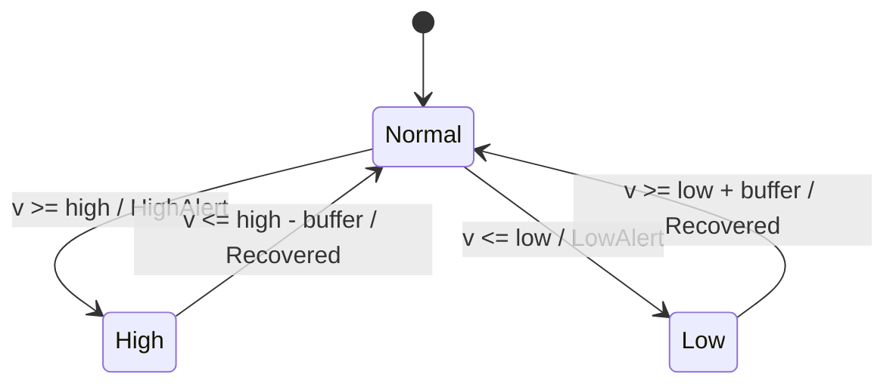
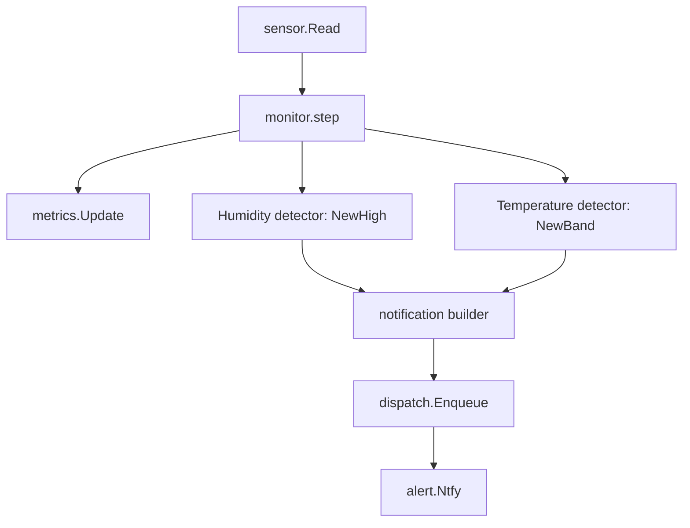

# Temperature alerts: generalize the humidity detector into a band detector

**Date:** 2026-09-15
**Repo:** `github.com/e4jet/bme280mon` (`~/repos/bme280mon`)

## Purpose

`bme280mon` alerts on high humidity and on sensor failure. It reads temperature and exports it as a metric, but never alerts on it. This design adds temperature alerts with the same semantics as the humidity alerts: hysteresis, a high-priority alert on entering the bad condition, a low-priority notice on recovery, and delivery through the existing dispatcher.

Temperature is two-sided (too cold and too hot both matter), while humidity is one-sided. The reuse goal therefore lands on the detector: one state machine serves both quantities instead of a second, parallel implementation.

## Project guidelines (binding)

This change **MUST** follow `docs/project-guidelines.md`. The rules that bind hardest here:

- **Design:** confirm data flow and failure modes before writing code. This document is that confirmation.
- **Security:** validate inputs. The new config keys are validated at load time like every existing key.
- **Style:** `gofmt`, small focused functions, input structs for functions taking more than 3 arguments, input structs declared before their consumer.
- **Branching:** develop on a branch, merge to `main` via PR.

## Decisions

Recorded plan, do not relitigate these:

| Decision | Choice |
|---|---|
| Enablement | Always on, thresholds default to 15.0 and 30.0 degrees C |
| Hysteresis | Its own key, `temperature_buffer`, default 1.0 degrees C |
| Reuse mechanism | Generalize `detector.Detector` into a band detector with an optional low bound |
| Humidity behavior | Unchanged, byte-identical notifications |
| Alert priority | `alert.High` on both low and high, `alert.Low` on recovery |

### Approaches considered

| Approach | Verdict |
|---|---|
| A. Band detector: one three-state machine per quantity, low bound optional | Chosen. One state machine per physical quantity, no cross-talk possible, about 40 lines added |
| B. One-sided detector with a direction flag, two instances for temperature | Rejected. Two independent state machines track one quantity, and the monitor must then suppress the case where both emit in one step |
| C. A separate temperature detector package | Rejected. Duplicates the state machine, which is what this change exists to avoid |

## Design

### Detector (`internal/detector`)

`Detector` gains a low bound and a third state.

States: `Normal`, `High`, `Low`.

Events: `None`, `HighAlert`, `LowAlert`, `Recovered`. `Recovered` covers both directions; the notification text is built from the quantity, not from which direction it recovered.

Constructors:

- `NewHigh(high, buffer float64) *Detector` sets the low bound to `math.Inf(-1)`, so `v <= low` is never true and behavior matches the current one-sided detector exactly. Humidity uses this.
- `NewBand(low, high, buffer float64) *Detector` sets both bounds. Temperature uses this.

The `-Inf` sentinel is internal. It never appears in config, in validation, or in a notification.

Transitions in `Update(v float64) Event`:

| From | Condition | To | Event |
|---|---|---|---|
| `Normal` | `v >= high` | `High` | `HighAlert` |
| `Normal` | `v <= low` | `Low` | `LowAlert` |
| `High` | `v <= high - buffer` | `Normal` | `Recovered` |
| `Low` | `v >= low + buffer` | `Normal` | `Recovered` |

Any other reading returns `None`. A reading is checked against `high` before `low`; the config validation below guarantees the two conditions cannot both hold.

### Config (`internal/config`)

Three new keys, with defaults that make temperature alerting active on upgrade without editing an existing config file:

| Key | Type | Default | Meaning |
|---|---|---|---|
| `temperature_low_threshold` | float | `15.0` | degrees C at or below which the low alert fires |
| `temperature_high_threshold` | float | `30.0` | degrees C at or above which the high alert fires |
| `temperature_buffer` | float | `1.0` | hysteresis gap, applied in both directions |

`Config` gains `TemperatureLowThreshold`, `TemperatureHighThreshold`, and `TemperatureBuffer`. `Validate` gains, in the style of the existing humidity checks:

- Both thresholds within `[-40, 85]`, the BME280's rated operating range. A threshold outside it can never fire, which is a misconfiguration worth reporting at startup.
- `temperature_low_threshold < temperature_high_threshold`.
- `temperature_buffer >= 0`.
- `2 * temperature_buffer < temperature_high_threshold - temperature_low_threshold`. This keeps the two recovery points ordered: without it, the recovery point for a high alert can sit below the recovery point for a low alert, and a reading between them satisfies neither.

Each failure returns an error wrapping `ErrInvalidConfig`, matching every other check in the function.

### Monitor (`internal/monitor`)

`monitor.Deps` replaces `Detector *detector.Detector` with two fields, `Humidity` and `Temperature`. `main.serve` builds them with `detector.NewHigh(cfg.HumidityThreshold, cfg.HumidityBuffer)` and `detector.NewBand(cfg.TemperatureLowThreshold, cfg.TemperatureHighThreshold, cfg.TemperatureBuffer)`.

`humidityNotification` generalizes into a quantity table built once in `monitor.New`. Each entry holds the quantity's display name, the format verb for its value in a title, an accessor for its value on a `sensor.Reading`, and its detector. `step` walks the table, feeds each detector the reading, and enqueues at most one notification per quantity per poll.

Titles, from the existing humidity forms:

| Event | Humidity | Temperature |
|---|---|---|
| `HighAlert` | `⚠️ Humidity high: 65%` | `⚠️ Temperature high: 31°C` |
| `LowAlert` | not reachable | `⚠️ Temperature low: 14°C` |
| `Recovered` | `✅ Humidity back to normal: 55%` | `✅ Temperature back to normal: 22°C` |

The body is unchanged for every notification: `Humidity 55.0%, temperature 21.0°C`. It already carries both readings, so both quantities can share it.

### Data flow

### Failure modes

| Mode | Behavior |
|---|---|
| Thresholds invalid or inverted | Startup failure from `config.Load`, reported like every other config error |
| Sensor read fails | Unchanged. No detector is fed, so no state changes and no spurious recovery fires on the next good read |
| Temperature flaps around a threshold | The buffer suppresses re-alerting, same as humidity |
| ntfy unreachable | Unchanged. The dispatcher retries and counts `bme280_notify_errors_total` |

### Out of scope

- No new metrics. Temperature is already exported as `bme280_temperature_celsius`, and alert state is derivable from it downstream.
- No pressure alerts.
- No per-quantity ntfy topics or priorities.

## Testing strategy

Unit tests, `-race`, behind the existing `unit` build tag.

| Test | Covers |
|---|---|
| `detector`: high-only band | `NewHigh` reproduces the current humidity transitions, including the existing table cases |
| `detector`: two-sided band | `LowAlert` on crossing down, `Recovered` on rising back past `low + buffer`, flapping inside each dead band does not re-alert, a full low/normal/high cycle |
| `detector`: no cross-talk | A reading crossing into `Low` from `High` passes through `Normal` and emits `Recovered` first |
| `config`: new key validation | Defaults load, inverted thresholds rejected, out-of-range thresholds rejected, negative buffer rejected, a buffer wide enough to cross the recovery points rejected |
| `monitor`: temperature alerts | A reading sequence produces the high, low, and recovery notifications with the expected titles and priorities |
| `monitor`: independence | A temperature transition and a humidity transition in one poll produce two notifications |

## Documentation

- `README.md`: the config table gains the three keys, and the alerts section describes the temperature band.
- `install/examples/config.yaml` and `install/examples/second-sensor.yaml`: the three keys with their defaults and a comment each.
