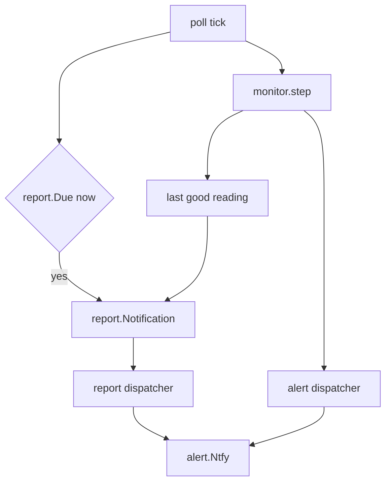

# Daily report: send the current temperature and humidity once a day via ntfy

**Date:** 2026-10-06
**Repo:** `github.com/e4jet/bme280mon` (`~/repos/bme280mon`)

## Purpose

`bme280mon` notifies only on threshold crossings, sensor failure, and its own start and stop. On a quiet day the phone shows nothing, which reads the same as a dead daemon. This design adds one low-priority notification per day at a configured local time, carrying the current temperature and humidity. It doubles as a daily heartbeat.

## Project guidelines (binding)

This change **MUST** follow `docs/project-guidelines.md`. The rules that bind hardest here:

- **Design:** confirm data flow and failure modes before writing code. This document is that confirmation.
- **Security:** validate inputs. The new config key is validated at load time like every existing key.
- **Concurrency:** tie goroutine lifetime to a `context.Context`. The new dispatcher runs under the same `ctx` as the existing one.
- **Testing:** table-driven, deterministic, hermetic. The clock and time zone are injected.

## Decisions

Recorded plan, do not relitigate these:

| Decision | Choice |
|---|---|
| Enablement | Config key `daily_report_time`, default `"12:00"`. `disable` (any case) turns it off. Empty string is rejected |
| Time zone | System local time (`time.Local`, from `/etc/localtime`). No time zone key |
| Priority | `alert.Low` (silent delivery) |
| No current reading | Send the last good reading with its age. With no reading since start, send "no reading available" |
| Scheduling | Checked on each poll tick against the wall clock, inside the Monitor goroutine |
| Delivery | A second `dispatch.Dispatcher` instance used only for reports |

### Approaches considered

| Approach | Verdict |
|---|---|
| A. Check on each poll tick inside the Monitor | Chosen. No new goroutine or shared state. The Monitor already holds the last reading. Wall-clock comparison is correct after an NTP clock jump. Precision is `poll_interval` |
| B. Separate scheduler goroutine with a `time.Timer` until the next report time | Rejected. Needs a mutex-protected snapshot of the last reading. A timer runs on the monotonic clock, so on a Pi without an RTC a boot-time NTP jump makes it fire at the wrong wall time |
| C. External systemd timer that reads `/metrics` and posts to ntfy | Rejected. Copies the secret topic into a second place and sits outside the Go tests |

### Why a second dispatcher

`dispatch.Dispatcher` keeps one notification: a new one supersedes any earlier one still being retried. Sharing it would let the report drop a high-priority alert that is mid-retry at report time. A separate instance isolates the two streams. A report still retrying when the next day's report arrives is superseded by it, which is the wanted behavior.

## Design

### Config (`internal/config`)

| Key | Type | Default | Meaning |
|---|---|---|---|
| `daily_report_time` | string `HH:MM`, 24-hour | `"12:00"` | local wall-clock time of the daily report. `disable` (any case) turns it off. `""` is rejected so a blank value cannot pass for either. A missing or null key keeps the default |

`Config` gains `DailyReportEnabled bool`, `DailyReportHour int`, and `DailyReportMinute int`. `Load` compares the value to `disable` with `strings.EqualFold`, and otherwise parses it with `time.Parse("15:04", v)`. A parse failure returns an error wrapping `ErrInvalidConfig` with the field name, matching `parseDur`. The default applies to existing config files that lack the key, so upgraded installs start sending the report.

### Report (`internal/report`, new)

Pure logic with no I/O. It depends on `alert` and `sensor` types only.

```go
// Options configures a Schedule. Declared before New per the input-struct convention.
type Options struct {
	Hour, Minute int
	Location     *time.Location // nil means time.Local
	Stale        time.Duration  // a reading older than this is reported with its age
	Start        time.Time      // process start, used to suppress a report after a restart
}

func New(o Options) *Schedule
func (s *Schedule) Due(now time.Time) bool
func (s *Schedule) Notification(r sensor.Reading, ok bool, now time.Time) alert.Notification
```

`Due` rules:

- The report is due when the wall clock of `now` in `Location` is at or past `Hour:Minute` and today's date is later than the last reported date. When `Due` returns true it records today's date.
- At construction, if the wall clock of `Start` is at or past `Hour:Minute`, the last reported date is set to that day. A restart after the report time therefore does not send a second report.
- Dates are compared as calendar dates in `Location`. A backward clock jump to an earlier date does not re-fire, because that date is not later than the last reported date.
- DST: the check compares wall clocks and never builds the report instant with `time.Date`, whose result inside a gap differs by zone. A report time inside a DST gap (for example `02:30` on a spring-forward day) fires once, at the first tick after the gap, for a gap of any length. A repeated hour at fall-back fires once, because a date fires at most once.

`Notification` output:

| Case | Title | Body |
|---|---|---|
| Fresh reading (`now - r.Time <= Stale`) | `📊 Daily: 21°C, 47%` | `Humidity 47.2%, temperature 21.3°C` |
| Stale reading | `📊 Daily: 21°C, 47%` | `Humidity 47.2%, temperature 21.3°C (last reading 2h5m3s ago)` |
| No reading since start (`ok == false`) | `📊 Daily: no reading available` | `no successful sensor read since start` |

The title carries both values so they show on a lock screen. Priority is `alert.Low` in all cases. `alert.WithLocation` adds the location prefix as it does for every notification. `Stale` is set to `2 * poll_interval` in `main`.

### Monitor (`internal/monitor`)

`Deps` gains `Report *DailyReport`. Nil when the report is disabled. `DailyReport` groups the report's collaborators so enabling the report supplies all of them, and all are required:

- `Schedule *report.Schedule`.
- `Dispatcher Dispatcher`.
- `Now func() time.Time`. `time.Now` in production, a fake in tests.

`Monitor` gains `last sensor.Reading` and `haveReading bool`, set on each successful read. The reading's age comes from `last.Time`. Both are owned by the Monitor goroutine, so no locking is needed.

`Run` starts `Report.Dispatcher.Run(ctx)` alongside the existing dispatcher when `Report` is non-nil. Each tick calls `step` and then `maybeReport`. `maybeReport` runs whether the read succeeded or failed, and calls `Report.Schedule.Due(Report.Now())`. When it returns true, it enqueues `Report.Schedule.Notification(...)` on `Report.Dispatcher` and logs `Info "daily report queued"`.

### Main (`bme280mon.go`)

When `cfg.DailyReportEnabled`, `serve` builds a `monitor.DailyReport`: the second dispatcher with the same `Notifier`, `Metrics`, and `Logger`, and the `report.Schedule` with `Location: time.Local`, `Stale: 2 * cfg.PollInterval`, and `Start: time.Now()`. When disabled, it passes nil and builds neither.

### Data flow



### Failure modes

| Mode | Behavior |
|---|---|
| `daily_report_time` malformed | Startup failure from `config.Load`, reported like every other config error |
| Sensor failing at report time | Report sends the last good reading with its age, or "no reading available" |
| ntfy unreachable at report time | Report dispatcher retries with backoff and counts `bme280_notify_errors_total`. Superseded by the next day's report or ended by shutdown |
| Alert mid-retry at report time | Unaffected. The report uses its own dispatcher |
| Daemon down at report time | No report that day. A start after the report time does not send one. The absence of the report is the signal |
| Restart after report time | No duplicate. The construction rule marks the day as reported |
| NTP forward jump at boot crosses the report time | One report, sent at the first tick after the jump. Possibly late, never duplicated |
| Pi time zone not set | Report fires at 12:00 in whatever zone `/etc/localtime` names (often UTC). Documented in the README |

### Out of scope

- No pressure in the report.
- No time zone config key.
- No min/max/average over the day. The report is the latest reading only.
- No new metrics.

## Testing strategy

Unit tests, `-race`, behind the existing `unit` build tag. Tests use a fixed `time.Location` (`time.FixedZone`) and explicit `time.Time` values, never the host clock or zone.

| Test | Covers |
|---|---|
| `report`: `Due` table | Before target, at target, after target, second call same day, next day, start after target, backward jump to an earlier date, forward jump across target |
| `report`: `Notification` table | Fresh reading, stale reading with age, no reading. Titles, bodies, and `alert.Low` priority |
| `config`: `daily_report_time` | Default `"12:00"`, null keeps the default, `"07:30"`, `disable`/`DISABLE`/`Disable` turn it off, `""`, `"25:00"`, `"12"`, `"noon"`, `disabled` rejected with `ErrInvalidConfig` |
| `monitor`: report routing | A fake clock crossing the target enqueues one report on the report dispatcher and nothing on the alert dispatcher |
| `monitor`: disabled | `Report == nil` never enqueues a report |
| `monitor`: failing sensor | Reads fail at the target, and the report carries the last good reading |

## Documentation

- `README.md`: the config table gains `daily_report_time`. The ntfy section lists the daily report next to the lifecycle notices and notes that the Pi's time zone must be set (`sudo raspi-config` -> Localisation Options -> Timezone).
- `install/examples/config.yaml` and `install/examples/second-sensor.yaml`: the key with its default and a comment.
